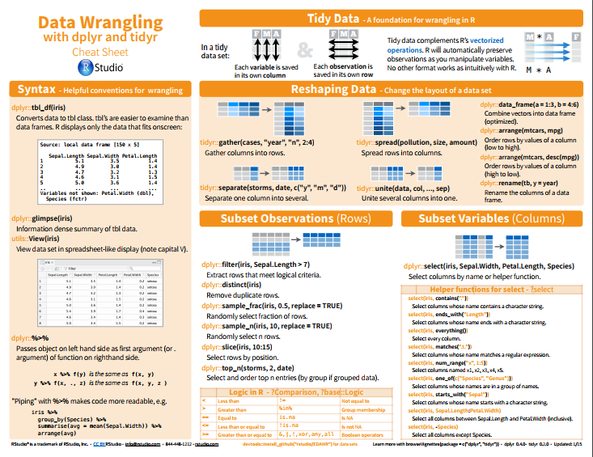

Best Practices in Teaching R
========================================================
author: Erin Grand
date: November 28, 2017
autosize: true
css: custom.css
font-family: 'Franklin Gothic Book'
transition: none

<style>
.reveal h1, .reveal h2, .reveal h3 {
  word-wrap: normal;
  -moz-hyphens: none;
}
</style>

<!-- How you developed the best practice and who engages with it at your school. -->
<!-- What makes this practice so successful? Processes? Training? Buy-in? Something else? -->
<!-- How would you recommend people replicate this at their schools? -->
<!-- Are there any adaptions that you've learned along the way that you'd recommend for implementing this? -->

Previously...
========================================================
incremental: true
<hr></hr>

- System that worked, but was hard and long
- Excel workbooks to process data
- Long detailed process to download, clean and process data


Why Choose R?
========================================================
<hr></hr>

- **Free:** R and Rstudio are free and open sourced!
- **Reproducible:** Easy to run scripts again with updated data.
- **Collaboration:** Results are easy to share as a PDF.
- **Manipulation:** Data manipulation is much easier due to the tidyverse.
- **Understandable:** You can easily follow along in someone else's code.
- **Spot Checking:** You can QC yourself along the way, instead of all at the end. 
- **Help:** Finding answers to your programming questions is a quick google away.

Pain Point: Time!
========================================================
incremental: true
<hr></hr>

It takes serious TIME to move everyone and everything to code.

- Dedicate time to designing and giving PD
- Steep learning curve outside of PD
  - Required 1:1 training and code reviews
- Redesign of project plans for analyses to use automation
<div class="footer">@astroeringrand</div>

<!-- With R... -->
<!-- ======================================================== -->
<!-- - Entire state test analyses from raw data to dashboard is done with scripts (push button analysis) -->
<!-- - Analyses are reproducible from year to year and month to month -->
<!-- - Projects can passed between people with little on boarding time -->

Training Practices
========================================================
<hr></hr>

- Materials such as Slides + Cheat sheets available online
- Following examples in *R for Data Science*
- Practice questions and examples
- Pair coding
- Code reviews
- Use of my own mistakes as examples of what not to do

R Scope and Sequence
========================================================
<hr></hr>

- **Base R**: Data structures, data types, basic of coding, simple stats
- **Tidyverse**: Tibbles, `dplyr`, `%>%`
- **Data Cleaning**: `janitor`, `tidyr`
- **Data Checks**: `assertr`
- Functions
- PURRR
- More advanced statistics (i.e regressions)


Example: Data Types
========================================================
<hr></hr>

Data type | Example
------------- | -------------
Integer | `1`
Logical | `TRUE`
Numeric | `1.1`
String / character  | `"Red"`
Factor (enumerated string) | `"Amber"` or 2 in `c("Red","Amber","Green")`
Complex | `i`
Date | 2015-04-24
NA | NA


Example: Mutate
========================================================
<hr></hr>

Besides selecting sets of existing columns, it's often useful to add new columns that are functions of existing columns. That's the job of `mutate()`.


```r
library(tidyverse)
library(fivethirtyeight)

avengers <- mutate(fivethirtyeight::avengers, 
       death1 = if_else(!is.na(death1) & death1, 1, 0 ),
       death2 = if_else(!is.na(death2) & death2, 1, 0 ),
       death3 = if_else(!is.na(death3) & death3, 1, 0 ),
       death4 = if_else(!is.na(death4) & death4, 1, 0 ),
       death5 = if_else(!is.na(death5) & death5, 1, 0 ),
       total_deaths = death1 + death2 + death3 + death4 + death5)
```


**Task: Create a column called `Pass` that describes if the student is predicted to pass the exam (1) or not (0).**


Cheat Sheets
========================================================
<hr></hr>


***


Example Code
========================================================
<hr></hr>


```r
library(tidyverse)
library(janitor)

students <- read_excel(filepath, sheet="Sheet1", col_types = "text") %>%
  clean_names() %>%
  remove_empty_cols() %>%
  mutate_at(vars(entrydate, exitdate, student_id, yearsinuncommon), as.numeric) %>%
  mutate_at(vars(entrydate, exitdate), excel_numeric_to_date)
```


```r
students %>% 
  get_dupes(student_id)
```

```
# A tibble: 2 x 6
  student_id dupe_count grade yearsinuncommon  entrydate exitdate
       <dbl>      <int> <dbl>           <dbl>     <date>    <int>
1    2372700          2     1               1 2017-11-28       NA
2    2372700          2     2               1 2017-11-28       NA
```

Learnings Along the Way
========================================================
<hr></hr>

- Choose the packages that are needed every day
- Have someone that is active in R community, so that you can be on the cutting edge.
- The more practice someone has, the faster they'll learn. Pair PD sessions with coding projects.

========================================================
type: qa
<div class="footer">@astroeringrand</div>

<div style="position:fixed; top:50%;text-align:center;width:100%; display:block;   font-size: 150px;">
Q & A
</div>

