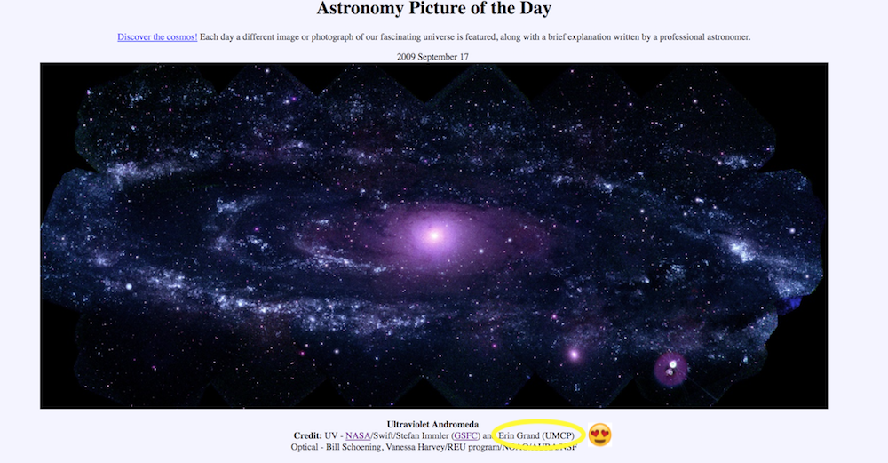

## Orginal Plan - Scrape from Archive

A long while ago now, [Nujchare](https://twitter.com/Nujcharee) tweeted about an awesome vis she did using `rvest` and PowerBi. 

<blockquote class="twitter-tweet" data-lang="en"><p lang="en" dir="ltr">Using rvest + purrr packages to scrap APOD. PowerBI viz it up real nice! <a href="https://twitter.com/hashtag/rstats?src=hash&amp;ref_src=twsrc%5Etfw">#rstats</a> <a href="https://twitter.com/hashtag/powerbi?src=hash&amp;ref_src=twsrc%5Etfw">#powerbi</a>. My learning journal during <a href="https://twitter.com/hashtag/NASADatanauts?src=hash&amp;ref_src=twsrc%5Etfw">#NASADatanauts</a> year of awesomeness.  <a href="https://t.co/cnwttLPoIS">https://t.co/cnwttLPoIS</a> <a href="https://t.co/je511h99L9">pic.twitter.com/je511h99L9</a></p>&mdash; Nujcharee (เป็ด) (@Nujcharee) <a href="https://twitter.com/Nujcharee/status/939257591431036929?ref_src=twsrc%5Etfw">December 8, 2017</a></blockquote>
<script async src="https://platform.twitter.com/widgets.js" charset="utf-8"></script>

I complemented her work and she asked me to look over the code. I jumped at the chance, (1) because I don't know a ton about scraping website data and wanted to see what she started, (2) I could help with the `dplyr` part of the code, and most imporantly (3) I love APOD!

I love APOD so much, that for most of my childhood my life goal was "get a picture published to APOD." To make matters more exciting in 2009 [this happened](https://apod.nasa.gov/apod/ap090917.html).



## Getting the Data

To start, we grab the information from the landing page of APOD's archive and ignore any links that are not pictures of the day. (Luckily, these all start with "ap" so we can use `str_detect()` to find them.)


```r
library(rvest)
library(tidyverse)
library(tidytext)

## scrape the landing page
apod <- read_html("https://apod.nasa.gov/apod/archivepix.html")

## scrape all URLs
url <- html_nodes(apod, "a") %>% 
  map_chr(xml_attrs) %>%
  tibble(url = .) %>%
  filter(str_detect(url, "ap"), !str_detect(url, "/"))
```


Next, we have to go to each of the pages and scrape the underlying page data. There are A LOT of APODs, so this can take a long time. I've chosen to only look at the first 1000 images for now. (More on solving this at the end!)

```r
# read html from url
my_read_html <- function(url, ...) {
  xml2::read_html(url, ...)
}

data_raw <- url[1:1000, ] %>% # first 1000 links
  mutate(full_url = paste0("https://apod.nasa.gov/apod/", url)) %>%
  mutate(page = map(full_url, my_read_html),
         pic = map_chr(page, ~html_node(.x, xpath = "//*/img") %>% html_attr("src")),
         title = map_chr(page, ~html_nodes(.x, "title") %>% html_text()),
         description = map_chr(page, ~html_nodes(.x, "p") %>% html_text() %>% .[str_detect(., "Ex")]) # descriptions start with "Explanation:"
         )
```


## Data Cleaning

With the raw data in hand, I move into more specific text cleaning. I want to start with some quick tidy text analysis of the descriptions, so I cant to clean that up first.


```r
data <- data_raw %>% 
  mutate(description = str_replace_all(description, "\n", " "),
         description = str_replace_all(description, "Explanation:", ""),
         title = str_replace_all(title, "\n", " "),
         title = str_replace_all(title, "APOD:", ""),
         title = if_else(str_detect(title, "2017 November 22"), "2017 November 22 - Oumuamua Interstellar Asteroid", title)
         ) %>%
  mutate_all(trimws) %>%
  separate(title, into = c("date", "title"), sep = " - ")
```


Great, now we can a do a quick word count using tidytext tools.

## Fun Stuff - word count

```r
keep_words <- c("way") # I don't want "way" as in "Milky Way" to be filtered
my_stop_words <- tibble(word = c("image")) %>%
  mutate(lexicon = "PERSONAL") %>%
  bind_rows(stop_words) %>%
  filter(!word %in% keep_words)
  

data %>%
  select(-date) %>%
  distinct() %>%
  unnest_tokens(word, description) %>%
  anti_join(my_stop_words) %>%
  count(word, sort = TRUE) %>%
  top_n(10)
```

```
## # A tibble: 10 x 2
##    word       n
##    <chr>  <int>
##  1 light   1088
##  2 star     725
##  3 stars    656
##  4 galaxy   636
##  5 nebula   627
##  6 moon     522
##  7 sun      497
##  8 earth    496
##  9 bright   461
## 10 sky      411
```


I love this because it clearly shows the types of objects that make up most of pretty Astronomy pictures, i.e stars, galaxies and nebulae. Very cool! 


If I look at bi-grams is there any doubt that "Milky Way" will have a strong showing?

```r
data %>%
  select(-date) %>%
  distinct() %>%
  unnest_tokens(word, description, token = "ngrams", n = 2) %>%
  select(title, word) %>%
  separate(word, into = c("word1", "word2"), by = " ") %>%
  unite(word, word1, word2, sep = " ") %>%
  count(word, sort = TRUE) %>%
  top_n(10)
```

```
## # A tibble: 10 x 2
##    word                n
##    <chr>           <int>
##  1 milky way         315
##  2 planet earth      205
##  3 way galaxy        133
##  4 million light     118
##  5 solar system      114
##  6 space telescope   106
##  7 star forming      100
##  8 hubble space       88
##  9 spiral galaxy      88
## 10 star cluster       75
```

...and there it is, clearly winning over "Planet Earth" and "Solar System." 

As a person who studied star formation, I'm also proud of the strong showing of "star forming" in the bi-grams. Yay baby stars!

## But wait... isn't there an API?

This is great and fun, but what I'd really love to look at the entire APOD archive, or pull a specific date. Luckily, NASA has a great [API](https://github.com/nasa/apod-api) to do just that! The API is super easy to use and simple enough to write into some R functions. I decided the coolest thing to do with this API was create a package, and thus my new package - [astropic](https://github.com/eringrand/astropic) was born (available on github)!

The goal of [astropic](https://github.com/eringrand/astropic) is to connect R to the NASA APOD API. The APOD API supports one image at a time. In order to supply more than that, this package also includes creating time ranges (of less than 1000 days at a time) and some historical data in tibble format.

You can install the current version from GitHub to check it out

```r
# install.packages("devtools")
devtools::install_github("eringrand/astropic")
```

[Astropic](https://github.com/eringrand/astropic) does not yet contain ANY tests and the documentation is very sparse. It is most definitely a work in progress - I'll update more as I add more to it. 

Next time on the blog, more about the package creation and cool things you can do with it. In the mean time, please feel free to send pull requests and let me know what you'd like from such a package.

